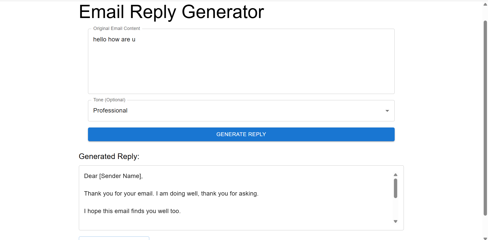
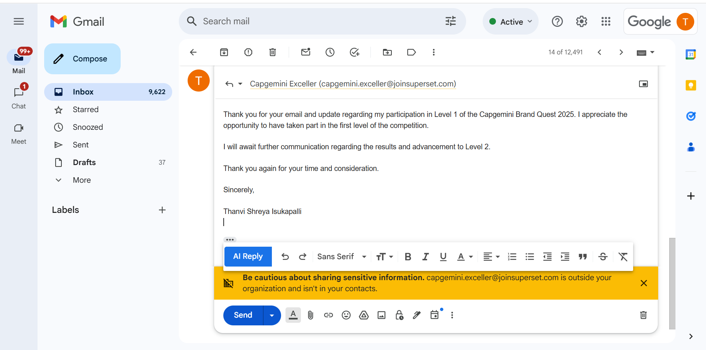

# ✉️ Gmail AI Reply Extension

A Chrome Extension that generates AI-powered email replies directly inside Gmail using **Gemini API**, eliminating the need to copy-paste emails into external tools. Users can select different tones such as **Professional**, **Casual**, and **Friendly**, and the response is auto-filled in Gmail’s compose box.  

---

## 🚀 Features

- 📨 **AI Reply Button** inside Gmail for instant AI-generated replies  
- 🎨 Choose reply tones: **Professional**, **Casual**, or **Friendly**  
- 🔗 Direct integration with **Gmail** (no external copy-paste)  
- 🖥️ Frontend built with **React + Vue** for a dynamic UI  
- ⚡ Backend powered by **Spring Boot** and **Gemini API**  
- 🌐 Packaged as a **Chrome Extension** for seamless access  

---

## 🛠️ Tech Stack

- **Frontend**: React, Vue  
- **Backend**: Spring Boot, Java, Gemini API  
- **Chrome Extension**: Chrome Extension APIs  
- **Build Tools**: Maven, Node.js, npm  

---
## 📸 Screenshots / Demo

### Home in Gmail

### Generated AI Reply

